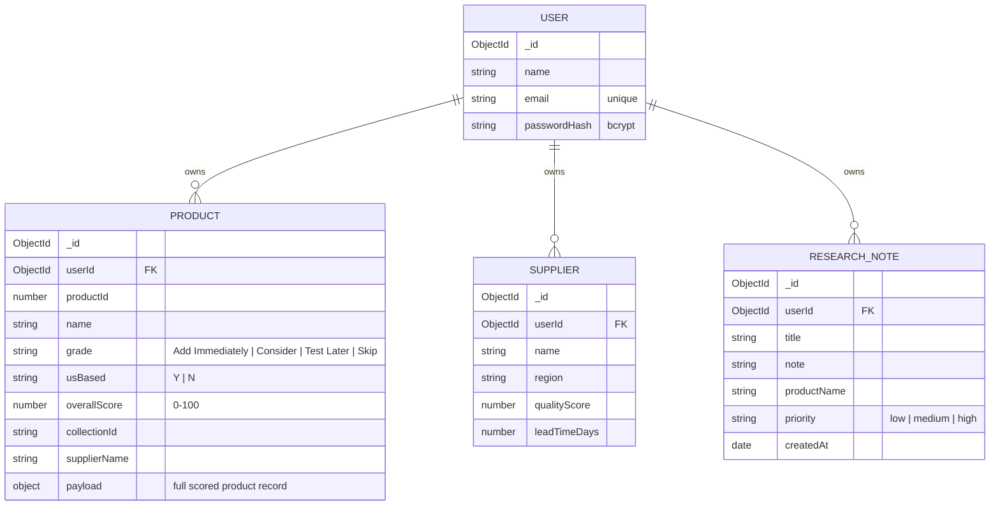

# Capstone Step 4 — Database Model

Project: **E-Commerce Product Research Dashboard**
Database: **MongoDB** (Mongoose ODM). Models are defined in `api/src/models.ts`.

## Entity relationship diagram

## Relationships and ownership

- Every business record carries a `userId` foreign key. **All queries filter by the
  logged-in user's id**, so one account can never read another account's catalog.
- One User has many Products, many Suppliers, and many ResearchNotes.
- A re-import **replaces** the user's Products and Suppliers (delete-then-insert),
  matching the real workflow of grading one supplier export at a time.

## Design notes

- `Product.payload` stores the full scored record (≈40 computed fields: costs,
  margins, per-factor scores, reasons, verdicts). Promoted top-level fields
  (`grade`, `usBased`, `overallScore`, `collectionId`) exist for indexing/sorting
  without reaching into the payload.
- Indexes: `userId` on every collection; products additionally sort on
  `overallScore` (descending) for the launch-list picker.
- If `MONGO_URI` is unset the API boots `mongodb-memory-server`, so reviewers can run
  the project with zero database setup; in production it points at MongoDB Atlas.
